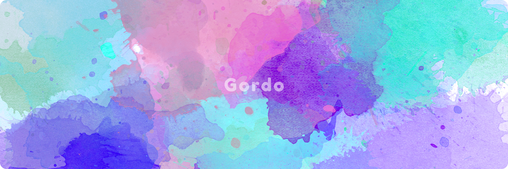

# Hi there, I'm Gordo 🦄

### Creative <b>multidisciplinary</b> professional who enjoys to be in the mix. 
I've worked and have deep experience in the whole product stack, from pure UI & UX design to the intrincancies of each technical layer under the hood, all the way to the leading aspect of bringing a product to life and leading creative and techincal teams to make it happen. Under all this, what I enjoy the most is building and creating those products.

I have been involved with early stage startups since 2014. 
I am used to wearing many hats and understanding each problem from a broad generic point of view.

## 🧑‍💻📱 Regarding coding:
### Senior Frontend Developer, now focused on web3 implementations.
### EVM Solidity developer, interested in NFTs, Identity (SSI), and Governance (DAOs and Voting)

## 🔮 Regarding product:
### Senior Product Designer and entrepreur.

I am currently working on collaborative and horizontal digital arts using NFTs as their primary vehicle, research about self sovereing identity (SSI), thinking and working with DAOs regarding the future of work.

I'm leading a group of curated developers in [d_d agency](https://agency.developerdao.com/)
And leading a protocol called [SONGS](https://songs-tools.com) with the goal of streamlining the music industry with a closer relationship Artist <> Fan. 
From time to time I update my [website](https://gordo.design)

### ✨ You can consult with me about custom and innovative NFT implementations, DAO formations and governance, and generic web3 products ✨
#### 📩 hello@gordo.design 📩
